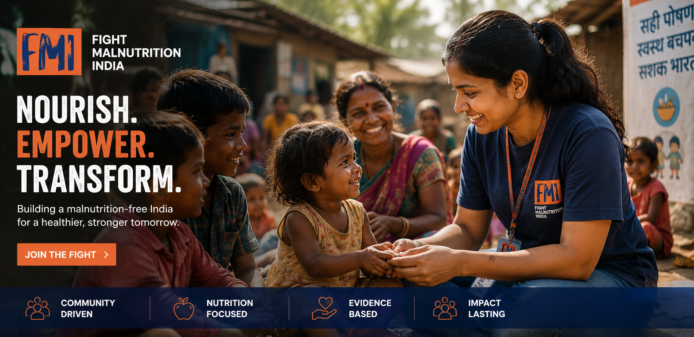
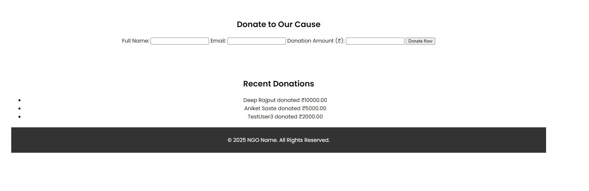
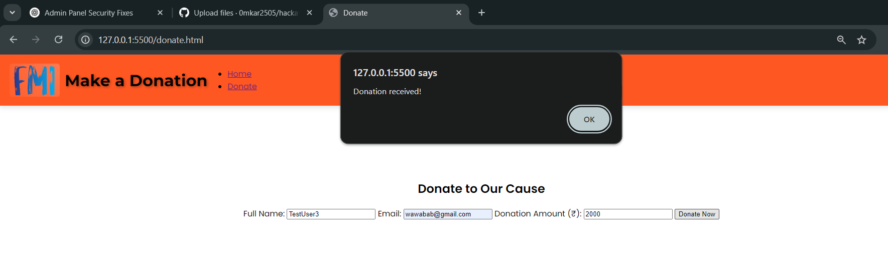
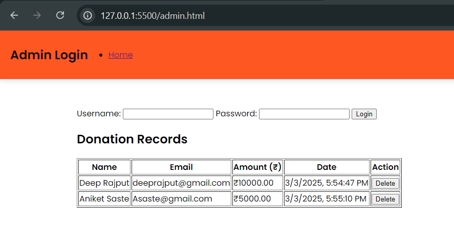
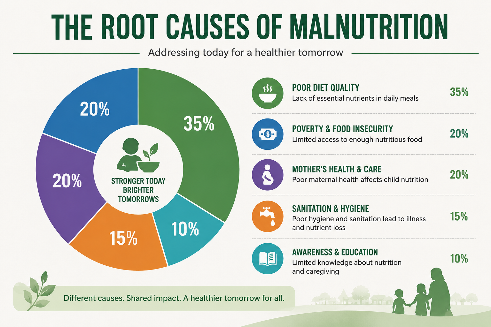
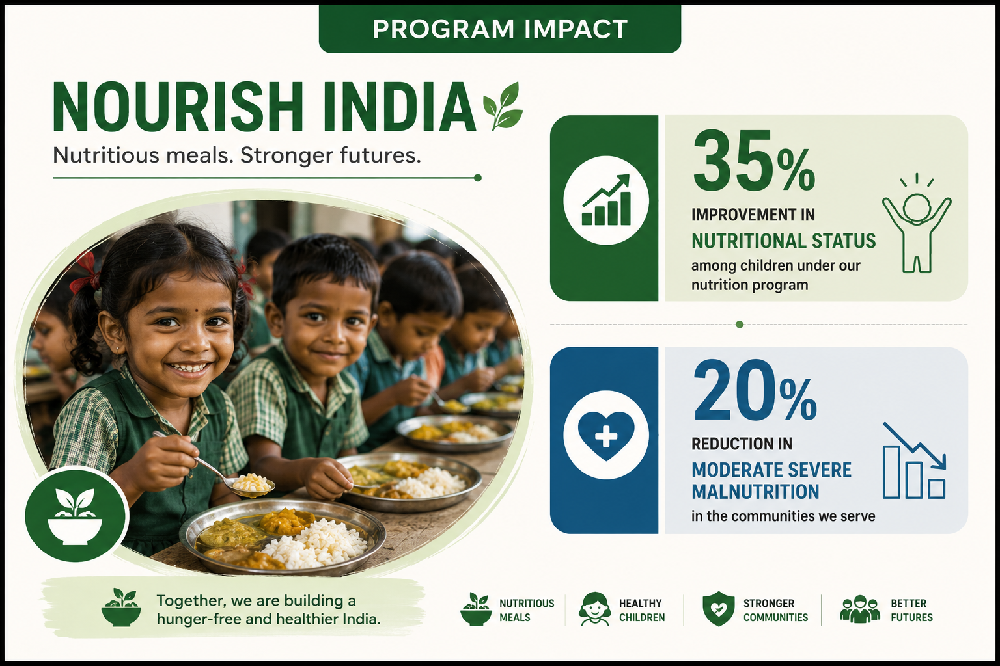
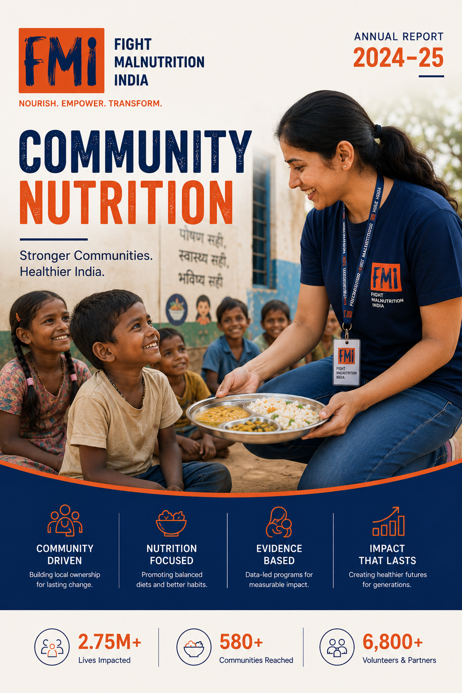

<p align="center">
  
</p>

<p align="center">
  <h1 align="center">Fight Malnutrition India</h1>
</p>

<p align="center">
  Full-stack NGO platform dedicated to ending child malnutrition through transparent fundraising, maternal care initiatives, administrative oversight, and community outreach across India.
</p>

<br>

<p align="center">
  
</p>

Fight Malnutrition India connects donors, healthcare workers, and communities to combat malnutrition at scale. The platform delivers a modern donation portal, community program exploration, impact transparency reports, and a protected administrative dashboard for managing donations and analytics.

Built as a full-stack web application with Node.js, Express, MongoDB, React, Tailwind CSS, and Vite.

<br>

## Architecture

Backend

- Node.js & Express
- MongoDB Atlas with Mongoose ORM
- JWT Authentication
- Bcrypt Password Hashing
- Express Rate Limiting Protection
- RESTful Donation & Admin Endpoints

Frontend

- React 18
- Vite Build Tooling
- Tailwind CSS & Custom Theme
- Lucide React Icons
- React Router (SPA Routing)
- Responsive Mobile-First Design

<br>

## Donation Portal

Donors can contribute seamlessly with custom amounts and direct impact tracking.

<p align="center">
  
</p>

The donation portal enables donors to select predefined tiers or custom amounts, providing instant form validation, secure processing, and 80G tax exemption eligibility details.

<br>

## Transaction & Contribution Records

Transparent record-keeping ensures accountability across all received donations.

<p align="center">
  
</p>

Contributions are cataloged with donor credentials, transaction amounts, and timestamps to maintain a verifiable audit trail of grassroots funding.

<br>

## Administrative Oversight & Management

Authorized administrators monitor contributions, donor statistics, and operational records in real time.

<p align="center">
  
</p>

The administration panel provides paginated donation records, real-time donor search and filtering, summary statistics, and one-click CSV export capabilities for financial auditing.

<br>

## Nutrition Causes & Field Research

The platform highlights evidence-based research on the core drivers of child malnutrition.

<p align="center">
  
</p>

In-depth educational resources break down the nutritional gap, addressing micronutrient deficiencies, maternal health, sanitation, and program implementation leakages.

<br>

## Community Programs & Field Impact

Grassroots initiatives operate across thousands of villages to deliver sustainable nutrition.

<p align="center">
  
</p>

Structured programs such as the Nourish India Program, Healthy Mothers Healthy Future, and Swachh Poshan Abhiyan drive measurable growth indicators and reduced anemia in high-priority districts.

<br>

## Transparency & Annual Reports

Publicly available audit documents and annual reports uphold rigorous governance standards.

<p align="center">
  
</p>

Donors and institutional partners can review published annual reports, financial breakdowns, and field metrics showing over 92% of funds directed directly to grassroots programs.

<br>

## Authentication & Security

Administrative operations are secured through industry-standard authentication safeguards.

JWT-based authentication with bcrypt password hashing and IP rate limiting protects sensitive donation records, prevents unauthorized tampering, and secures platform administration endpoints.

<br>

## Core Features

- Transparent donation processing with instant validation and feedback
- Protected administrative dashboard with search, sort, and pagination
- Real-time contribution analytics and donor statistics
- One-click CSV export for financial auditing and donor records
- 80G and 12A tax exemption compliance disclosures
- Interactive program showcase with measurable field outcomes
- Comprehensive nutrition research, causes, and educational modules
- Published annual reports and financial transparency filings
- Community testimonials and grassroots story highlights
- Responsive mobile-first interface powered by Tailwind CSS
- Rate limiting and DDoS protection on public submission endpoints

<br>

## Technology Stack

Backend

- Node.js
- Express
- MongoDB
- Mongoose
- JWT (jsonwebtoken)
- Bcrypt (bcryptjs)
- Express Rate Limit
- CORS & Dotenv

Frontend

- React 18
- Vite
- Tailwind CSS
- Lucide React
- React Router DOM
- PostCSS & Autoprefixer

Database & Infrastructure

- MongoDB Atlas
- RESTful JSON APIs
- Static SPA Asset Serving

<br>

## Getting Started

### Prerequisites

- Node.js (v18 or higher)
- MongoDB instance (local or MongoDB Atlas)

### Installation

1. Clone the repository:
```bash
git clone https://github.com/0mkar2505/NGO-Donation-Website.git
cd NGO-Donation-Website
```

2. Install backend dependencies:
```bash
npm install
```

3. Install frontend dependencies:
```bash
cd client
npm install
cd ..
```

4. Configure environment variables in a `.env` file in the root directory:
```env
PORT=5000
MONGO_URI=your_mongodb_connection_string
JWT_SECRET=your_jwt_secret_key
ADMIN_USERNAME=admin
ADMIN_PASSWORD_HASH=your_bcrypt_hashed_password
```

### Running the Application

Development Mode (Frontend with Vite Hot Reload):
```bash
npm run dev:client
```

Full Stack Production Mode:
```bash
# Build frontend
npm run build

# Start Express server
npm start
```
